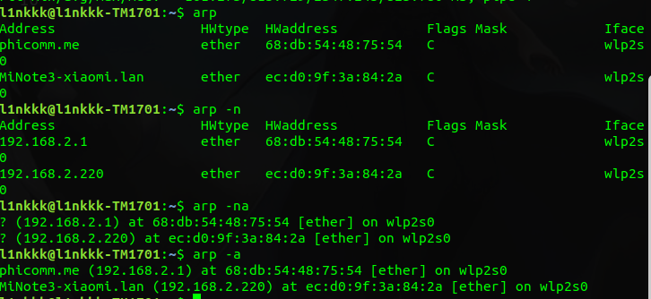

# 引言
ARP是一个通用的协议，从一般性看，它被设计为支持多种地址之间的映射，而不止MAC和IP地址。实际上，ARP几乎用于32位的ipv4和MAC地址之间的映射。
ARP的反向映射协议**RARP**，很少使用，主要用于缺少磁盘驱动器(通常是 无盘工作站 或 X终端)【tag:l1nkkk-待查】的系统。

------------
# 基本

ARP仅使用在广播网络，链路层能将消息交付到发送者同一个VLAN的所有主机；**如果在非广播网络**，需要更复杂的映射地址。
**同一广播域中的所有系统可接收ARP请求**，这包括可能根本不运行ipv4和ipv6协议的系统，但不包括位于不同Vlan中的系统。

# ARP缓存

在linux中可以使用arp命令来查看arp表。
-a表示列出所有。
-n表示不要用主机名代替IP。
