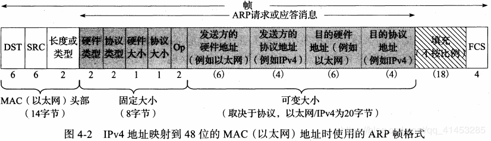

# 引言
ARP是一个通用的协议，从一般性看，它被设计为支持多种地址之间的映射，而不止MAC和IP地址。实际上，ARP几乎用于32位的ipv4和MAC地址之间的映射。 
ARP的反向映射协议**RARP**，很少使用，主要用于缺少磁盘驱动器(通常是 无盘工作站 或 X终端)【tag:l1nkkk-待查】的系统。 

------------
# 基本

ARP仅使用在广播网络，链路层能将消息交付到发送者同一个VLAN的所有主机；**如果在非广播网络**，需要更复杂的映射地址。 
**仅用于ipv4**,ipv6使用邻居发现协议,它被合并到ICMP6  
**同一广播域中的所有系统可接收ARP请求**，这包括可能根本不运行ipv4和ipv6协议的系统，但不包括位于不同Vlan中的系统。 

# ARP缓存

 
在linux中可以使用arp命令来查看arp表。 
-a表示列出所有。  
-n表示不要用主机名代替IP。  
各项代表的意义见书p116  
**需要特别注意Flags Mask**Flags Mask表标志包含一个符号C,M,P;  

| 符号 | 含义                                                             |
| ---- | ---------------------------------------------------------------- |
| C    | 动态学习得到的                                                   |
| M    | 手工静态输入的(arp -s)                                           |
| P    | 含义为”发布“，主机会对该IP的ARP请求做出响应，**用于设置ARP代理** |
# ARP帧
  
可以发现有一些重复的信息--发送方的硬件地址
